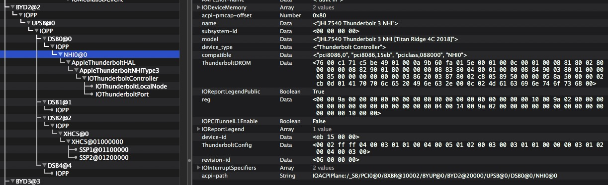
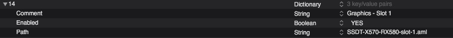
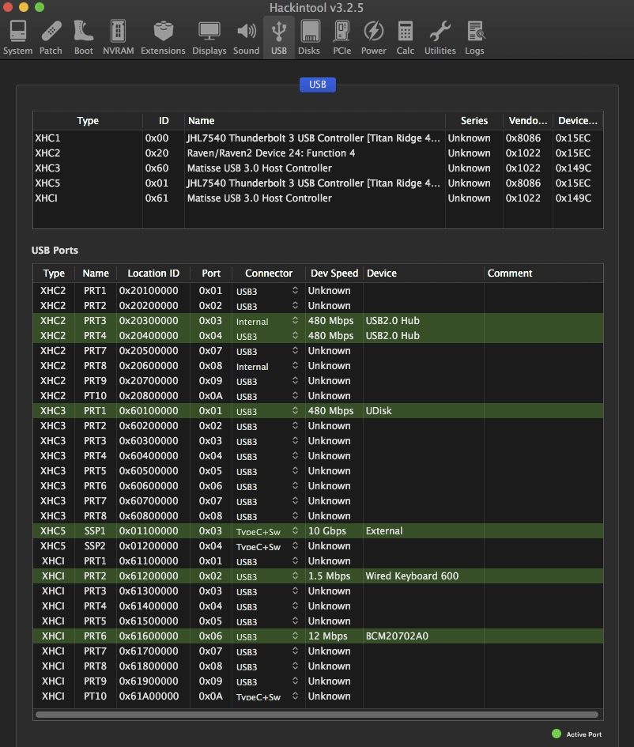
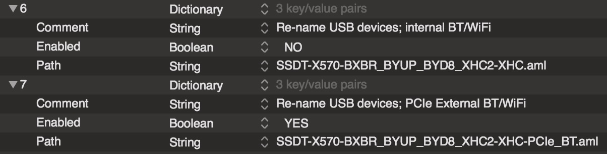
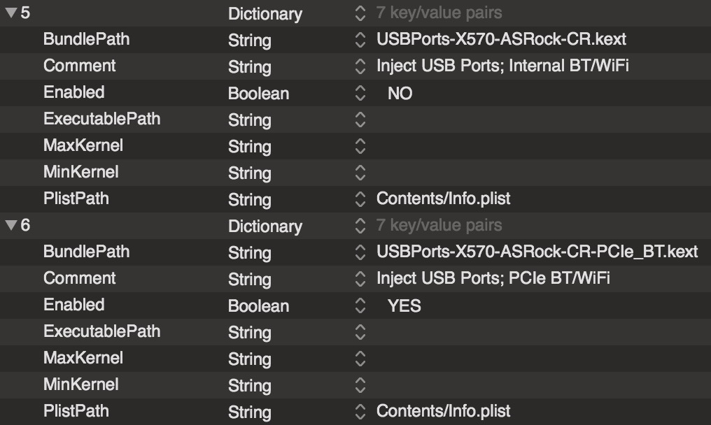
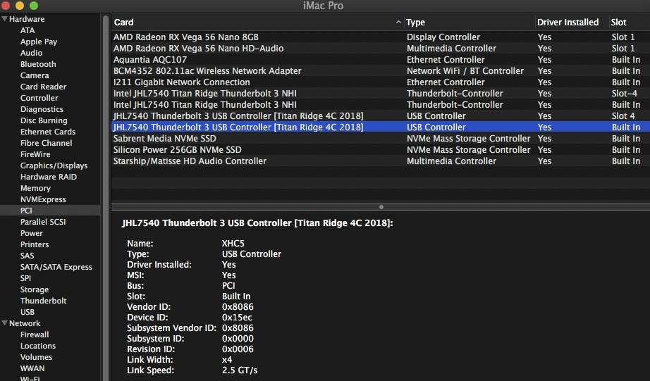

# OpenCore EFI for ASRock X570 Creator - AMD Hackintosh

This repository provides the basic contents for an EFI folder to successfully boot MacOS using an __ASRock X570 Creator__ motherboard,
using a Ryzen 9 CPU, such as a 3950X; aka AMD Hackintosh. The contents work with either _Mojave_ or _Catalina_. The intended SMBIOS is _iMacPro1,1_
although provisions are available for running _MacPro7,1_ which will be described below.

This repository is only designed for OpenCore bootloader. __OpenCore__ (OC) is best updated via Pavo's [OCBuilder](https://github.com/Pavo-IM/ocbuilder/releases) app. Accordingly, once you have a working EFI boot folder based on this repository, you can update various components of it as you see fit based on OCBuilder. But do be careful not to over write files or folders unique to this build. If updated, please study the Docs to see if the structure of the __config.plist__ file needs to be changed (this respository will attempt to be current with the most stable release). Keep in mind that OpenCore is evolving, and consequently, new versions can substantially effect the overall structure and functioning of the presently used __config.plist__ file.

This repository will also attempt to keep up-to-date the basics of this EFI folder unique to this build (in particular, the ACPI and Kexts folders). This respository assumes you are fine tuning an established build. If you are looking for details regarding how to setup OpenCore, how to create a bootable installation, how to trouble shoot errors, how to optimize your system and other related matters, please see the AMD-OSX/AMD-Vanilla [repository](https://github.com/AMD-OSX/AMD_Vanilla/tree/master) and especially, the AMD section in the very detailed [OpenCore-Guide](https://khronokernel.github.io/Opencore-Vanilla-Desktop-Guide/).

The EFI folder in this repository should be placed on the EFI partition of your boot drive (see Usage and Structure information below).

As of pre-release v057 (as of 3/15/20), OC has its own graphics menu system, named _OpenCanopy.efi_. See Section A5 (Driver section) for details.

And while this repository is specific for the __ASRock X570 Creator__ motherboard, much will be found in common with other __X570__ motherboards. Therefore, the contained EFI could easily serve as a starting point for those builds. Some areas where there will likely be differences: the Aquantia 10G SSDT, the USBPort kexts, and the SSDT-TB3 file. Disable those 3in the __config.plist__ file (ACPI section) before trying out. Later, change or remove them as you test your system.

OpenCore version numbers are not incremented for each minor adjustment, but incremented once stable. These small changes within a version can have marked structural changes and yet not be fully documented. Accordingly, it is best to use final release versions. Due to the sometimes daily changes, this repository will only upload changes if the commit seems stable and then note the date of compilation along with the version number. The present EFI folder is: 

***v057 - 3/20/2020***

## A. Contents

### 1. ACPI

The first few files, those without a _-X570-_ prefix, are for setting up AGPM injector, and _EC_ with other power adjustments. The x-AmdTable are fixes found by CaseySJ to ASRock SSDT mistakes. Meanwhile, the _-NVMe-ANSx_ files adjust the device names and correct internal drives appearing as external icons. The SSDTs _-BXBR_ and _-GP13_ rename the USB devices. 

The GPU SSDT files, such as _SSDT-X570-RX580-slot-1.aml_, primarily provide correct re-naming of the devices (although much is provided by WEG) and nice displays of the drivers within SystemInformaion/PCI on the Mac. Two of these do adjust the functioning of the PowerTables (Vega 56 and 64). These SSDT GPU files do not inject AGPM; that is provided through kext files described in the next section.

There are 3 included SSDT-NVMe-ANSx-X files which rename NVMe M2_x devices and inject information into the System Information/PCI section. The renaming behavior forces the disk icons to be updated and changed from external to internal icons on the desktop. The information changes in these files should be changed to reflect the brand and sizes of NVMe drives that you are using in your build. For example, ANS1 presently indicates that the NVMe SSD is "Corsair Force 600 NVMe 1TB SSD". If your SSD is a Samsung, then change the name (and model) to something like "Samsung PRO 970 NVMe 512GB SSD ".

The two _SSDT-NVMe-ANS1-X_ files describe the drive located at M2_1; and the _SSDT-NVMe-ANS2-X_ file describes the drive at M2_2 (M2_x issues are discussed below in section A6).

Finally, the _SSDT-X570-TB3-Builtin.aml_ file injects the correct XHC5 setting for USB3 functionality and renames the TB nodes. While TB3 is working, it is still incomplete: the TB device must be connected before boot and there is no hot-plug capability. Check the discusson sites listed below for current updates. Hopefully, the only update required to make TB3 fully functional will be a more complete SSDT-TB file replacing the one presently being used. Further, testnig is being done with a PCIe Titan Ridge TB card in Slot 4 (PCIe4), which was flashed the NVM 23. The SSDT for this is _SSDT-X570-Cr-TB3-GPP9-slot-4.aml_. While this file is included, it is disabled within the ACPI section of the __config.plist__ file. This SSDT injects the XHC device on the PCIe card as XHC1.

As of 3/8/20, there is discussion of how _ThunderboltDROM_ and _ThunderboltConfig_ seem to significant affect TB performance. In adjusting the SSDT files, the built-in TB seems to respond well to this injection (SSP1 and SSP2 are assigned to ports 3 and 4, respectively; see image below). SSP1 and SSP2 appear with or without a USB-C drive connected. When the drive is connected at boot, it mounts on the desktop (hot-plug still an issue).

Using a similar _ThunderboltConfig_ for the flashed TB3 PCIe4 card, does not yet give the same result. So again, TB is a work in progress.

On board TB3, using _SSDT-X570-TB3-Builtin.aml_:

### 2. Kexts

The contents of the Kexts folder can be broken down into various groups. 

First are the AGPMInjector kexts, which were made using Pavo's [AGPMInjector](https://github.com/Pavo-IM/AGPMInjector/releases) app. A few variations were created by selecting different, commonly used GPUs, while keeping the SMBIOS set at iMacPro1,1. These different versions allow flexible selection by the user. The AGPMInjector kext should be paired with a similarly named SSDT-GPU file within the ACPI folder. That is, you use one SSDT-GPU file for your selected GPU and one AGPMInjector kext specific for that same GPU. These should be entered and enabled within the ACPI and Kernel sections of the __config.plist__ file. Example (shown below): _SSDT-X570-RX580-slot-1.aml_ and _AGPMInjector-iMacPro1,1-RX580.kext_ both enabled as a pair in the __config.plist__ file.

SSDT-RX580:

AGPMInjector:

Other groupings within the Kexts folder include the BT/Wifi kexts: AirportBrcmFixup, BrcmBluetoothInjector, BrcmFirmwareData, BrcmPatchRAM3, and BT4LEContinuityFixup. If you've swapped out the stock Intel BT module for a Mac-compatible version (as described in [Swapping BT Module](https://forum.amd-osx.com/viewtopic.php?p=53060#p53060)), you'll want all of these enabled within the __config.plist__ file. On the other hand, if you've added a PCIe BT/WiFi card such as the Fenvi FV-T919 (with a Broadcom 94360CD), then most of these kext files are optional. A few other files will vary depending on whether you're using a swapped BT (SBT) or PCIe BT (PCIeBT). Those changes will be described below.

Yet another grouping are the essential kexts: AppleALC, AppleMCEReporterDisabler, Lilu, SmallTreeIntel82576_mod, VirtualSMC and WhateverGreen (WEG). Within the __config.plist__ file, in the Kernel section, Lilu must be first in order, followed by VirtualSMC. Similarly, WEG should be present before other graphics related kext files.

MacProMemoryNotificationDisabler is only to be enabled when using SMBIOS _MacPro7,1_ (which requires Catalina).

[USBWakeFixup](https://github.com/osy86/USBWakeFixup) is an attempt to fix wake issues. A modification to EC.aml was made to work in conjunction with this kext.

[NVMeFix](https://github.com/acidanthera/NVMeFix) and [SMCAMDProcessor](https://github.com/trulyspinach/SMCAMDProcessor) are useful for adjusting the functioning of NVMe drives, setting up power for TB3, and providing CPU temperature and frequency information. ACPIDebug (and the companion SSDT-RMDT.aml file) will only be used to debug and trouble shoot TB3 SSDTs at a future date. Both of these files should presently be disabled, or, if you choose, deleted. (ThunderboltReset was removed on 3/10/20; it was designed for Alpine Ridge and the mobo uses Titan Ridge.)

The above kext files may be updated independent of this repository using [Hackintool](https://www.insanelymac.com/forum/topic/335018-hackintool-v286/), [Kext Updater](https://bitbucket.org/profdrluigi/kextupdater/downloads/) or [OCBuilder](https://github.com/Pavo-IM/ocbuilder/releases). However, the final kext group described in the next paragraph are unique to this build and should not normally need updating, especially by a third party source. Nor, should other USBPort kext files be used in conjunction with them.

This final group consists of two USBPort injector kext files specific for this motherboard: _USBPorts-X570-ASRock-CR_ and _USBPorts-X570-ASRock-CR-PCIe_BT_. The former is for SBT builds; the latter, for PCIeBT builds. The repository default within the __config.plist__ file is for PCIeBT, not SBT, builds. 

Use one of these two USBPort injector kext files in parallel one of two ACPI files: SSDT-X570-BXBR_BYUP_BYD8_XHC2-XHCI and SSDT-X570-BXBR_BYUP_BYD8_XHC2-XHCI-PCIe_BT. Again, the former is for SBT builds and by default is disabled; the latter is for PCIeBT builds and is by default enabled in the __config.plist__ file. This pairing is re-explained below in section A3.

Together, these SSDT and kext files properly inject the USB ports and, in the case of the PCIeBT version, disable the internal Intel BT device (removing it's USB power supply). By removing the internal BT/WiFi device, the BT add-on card (ideally located at slot-5) will have less interference, and yet, if you use the computer to boot into Windows, the Internal device will work again. Whereas, if you use the SBT device, either MacOS or Windows will use the same device and it's USB power shouldn't be removed. This is why there are 2 sets of USBPort BT injector kexts.

For a complete USB port description, see the included Images folder for JPGs of the main mobo layout and the rear panel USB/Internal USB layout. See the Hackintools image for USB details below. This image reflects a swapped BT build (which is why there is a device at XHCI/PRT6), as well as a second TB3 PCIe card in slot PCIe4 with an assigned XHC of XHC1. The internal TB3 is assigned XHC5.

### 3. BT Settings

To clarify the above description, there are 2 sets of ACPI and kext files that you need to use. You need to enable one set, not both, within OpenCore. The two sets can be described as follows:

SET 1. SBT - Internal swapped BT, enable following (but disable those in SET 2):

    A. SSDT-X570-BXBR_BYUP_BYD8_XHC2-XHCI.aml

    B. USBPorts-X570-ASRock-CR.kext (injects PRT6 in XHCI, which supplies swapped BT/WiFi device)

SET 2. PCIeBT - PCIe BT module, enable following (but disable those in SET 1) - __DEFAULT__:

    A. SSDT-X570-BXBR_BYUP_BYD8_XHC2-XHCI-PCIe_BT.aml

    B. USBPorts-X570-ASRock-CR-PCIe_BT.kext (removes PRT6 from XHCI, which supplies internal BT/WiFi device)
    
The images below show the 2 sections, the ACPI and the Kernel sections, in the __config.plist__ file, where these files are to be enabled or disabled. (Note: XHC was renamed to XHCI on 3/7/20 with changes to various other files.)

ACPI section:

Kernel section:

### 4. System Information / PCI

This section shows the current status of the System Information section in Mac OS. The image shown represents a swapped BT/Wifi card and an extra TB3 PCIe card at PCIe. The TB3 USB devices are being injected within the DeviceProperties section of the __config.plist__ file, while the remaining devices are re-named within SSDT files.

### 5. Drivers

Only a few drivers are required with OpenCore: ApfsDriverLoader and OpenRuntime. Even HSSPlus is optional, but useful. AudioDxe, a new addition for OpenCore, is only needed if BootChime or some of the other newly introduced audio features are desired. The OC/Resources/Audio folder with its included WAV files are required for audio. The boot chime is the file OCEFIAudio_VoiceOver_Boot.wav. There are many other WAV files in the Audio folder when OC is freshly compiled; in face, over 90MB worth. Since this size can be too large for some EFI partitions, it was elected to remove all but the most rudimentary audio files from this folder for this repository. (See the Docs/Configuration.pdf for details on how to set up the audio features.) If you wish to have more WAV files, then compile OC on your own with OCBuilder and add them.

Other, potentially useful drivers include OpenUsbKbDxe, ExFatDxe and OpenCanopy. The latter activates a graphical user interface (menu system). OpenCanopy is turned on by default. To change, adjust the __config.plist__ file: see Misc/Boot/PickerMode = _External_. Change _External_ to _Builtin_ to disable the graphics menu system, returning to the built in text menu system.

VirtualSMC.efi is now part of OpenCore. This file, along with various settings in the __config.plist__ file, are required if you choose to use FileVault. This repository does not use FileVault and so those settings along with any associated files will be discussed. If you wish to use FileVault, then read the documentation and adjust the __config.plist__ as needed.

Note: when a driver listing is preceeded by the _#_ symbol, the driver entry is disabled. To activate, remove this symbol. An example would be _#NdkBootPicker.efi_. If you wish to use it instead of _OpenCanopy.efi_, then remove the symbol in front of _NdkBootPicker.efi_, but place one in front of _#OpenCanopy.efi_ to disable that menu system.

### 6. Problems with TB staus and M2_1 & M2_2 slots (AKA 'disapparing drives')

If the PCIe slot 6 (the large slot on the edge of the motherboard, farthest from the CPU; see included mobo image) is populated, and if TB is enabled, the _M2_2_ drive will disappear from BIOS. This means that the _M2_2_ drive is not available for booting (if BIOS can't see a drive, it can't boot from it).

But if the PCIe6 slot is empty and TB is enabled, the _M2_2_ SSD _will_ be present in BIOS, and thus bootable. Oddly, when the _M2_2_ slot has disappeared from BIOS, it will be visible on the desktop, so MacOS locates and mounts it nevertheless.

The problem is not just an ASRock issue, but can be found on MSI and ASUS forums, where people complain of 'disappearing' _M2_2_ drives. The problem lies with the X570 chip and how the PCIe and _M2_2_ slots are lane-shared.

To summarize:

+ PCIe6 ( used ) + TB enabled  --->  no M2_2 in BIOS
- PCIe6 (empty) + TB enabled  --->  M2_2 will appear in BIOS
+ PCIe6 ( used ) + TB disabled --->  M2_2 will appear in BIOS
- PCIe6 (empty) + TB disabled --->  M2_2 will appear in BIOS

One other problem, now concerning the _M2_1_ slot, is seen depending upon the TB status: the _M2_1_ slot device is assigned to different devices. When TB is enabled, _M2_1_ is assigned to PCI0/GGP2; however, when TB is disabled, the _M2_1_ is assigned to PCI0/GPP0. This is why there are two different SSDT aml files for _M2_1_ (labelled as ANS3 in this repository), known as _SSDT-X570-NVMe-ANS1-GPP0-noTB.aml_ and _SSDT-X570-NVMe-ANS1-GPP2-withTB.aml_. Both can actually be left enabled within OpenCore and either one will activate based on whether you have TB enabled or disabled.

The _SSDT-NVMe-ANS1-X_ files describe the drive located at M2_1; the _SSDT-NVMe-ANS2-X_ file describes the drive at M2_2.

### 7. BIOS ROM

Working within a PC environment means using BIOS and the manufacturer's typcial boot methods, which includes their logo. If we'd like a more Mac-like tone, what about changing the usual manufacturer's boot logo to one that is more Mac-like? This can be done through a modified BIOS. The BIOS included in this repository (_X570CTR2-10-mod.rom.zip_) is the latest v2.10 BIOS but contains a modified boot logo as shown below. 

Of course, to use you need to follow the X570 Creator manual in how to flash a BIOS to the X570 Creator motherboard. If you stored any settings for v2.10 on a drive, you can re-load these settings once you've flashed this BIOS (a settings file is also included in this repository). If you didn't save your settings externally, you'll have to re-enter all of your settings again: so prepare things ahead of time to make flashing easier. (When you flash a different version of a BIOS, settings cannot be re-loaded from another version; however, when staying within a version, you can re-load settings.)

### 8. BIOS Settings

If you load the included file, _Auto+TB-CSM.bin_, from within BIOS v2.10 (see motherboard manual on how to do this), you will have the basic optimal settings for this motherboard with TB enabled. The "Auto" portion in the file name refers to the fact that XMP has not been set, but left on Auto. Do note that this v2.10 settings file has manually reduced fan speeds; please adjust as necessary. Also, please confirm your boot order is correct under the BIOS Boot menu item before re-saving the settings.

Also, on the Advanced\AMD PBS page, in addition to enabling TB, the PCIe lanes were set to Gen3. Reportedly, the Gen3 setting is better for maxmizing performance from currently available GPUs. Experiment with the Gen3 vs Auto setting and see what works best for your build. Except for these discussed items, all other BIOS settings are default.

|                    |              |
| ------------------ | ------------ |
| TB                 |  Enabled     |
| Security Level     |  No Security |
| CSM                |  Disabled    |
| Above 4G decoding  |  Enabled     |

### 9. SMBIOS - How to Easily Update in OC

SMBIOS data can be generated using an old copy of Clover (but do NOT use Clover to edit the __config.plist__ files for OpenCore), or using the recommended [GenSMBIOS](https://github.com/corpnewt/GenSMBIOS). Also, do not use apps like "OpenCore configurator"; such editors will corrupt the __config.plist__ file.

If you already have SNs and UUIDs values in an existing OpenCore config file, then cloning that SMBIOS data is easy. OC allows you to simpliy copy and paste sections, such as the PlatformInfo section, between config files.

The images below show the steps. When editing the __config.plist__ file, the recommended editors are PlistEdit Pro, Xcode or [ProperTree](https://github.com/corpnewt/ProperTree).

- Backup the config files before starting.
- Open both files you're to copy between.
- Highlight and copy the old SMBIOS section (_PlatformInfo_) that has your working SNs, etc.
- Go to the new config file that has a SMBIOS with no SNs and highlight its PlatformInfo section.
- Do a paste, which leaves you with a file like the one shown in the image below.
- Delete the PlatformInfo section marked "PlatformInfo" (highlight and press the delete key). 
- Highlight and click into the remaining section marked _PlatformInfo 2_, editing out the space and 2 (" 2").
- Then save the file.

## B. Usage
 
- To build OpenCore using Pavo's OCBuilder, it is recommended to use the Release version with or without kexts update.
- Move the repository included folders for ACPI, Kexts and the plist files into EFI/OC folder created by OCBuilder.
- Verify that the proper driver efi files are in place, based on what is indicated within the __config.plist__ file.
- NOTE: the __config.plist__ file does not contain SNs or UUIDs but place-holders that say "FILL-IN". You must supply these 
        values on your own (see section A8 above for details).
- Again, editing of __config.plist__ files should only be done with PlistEdit Pro, Xcode or [ProperTree](https://github.com/corpnewt/ProperTree).
- There is a file named config-Only-For-Storage.plist. This file stores data that can be copy and pasted to the main
        __config.plist__ file. For example, inside is an entry "PlatformInfo-MacPro7,1". With both files open, you can high- 
        light and copy this section from the storage file to your __config.plist__ file, pasting immediately below your current
        PlatformInfo section. You can then remove the original PlatformInfo, replacing it with _PlatformInfo-MacPro7,1_. Then
        rename _PlatformInfo-MacPro7,1_ as _PlatformInfo_. Next, provide new SNs and UUID values for this section. (Alternately,
        you can enter SNs and UUIDs into the storage portion and keep sets of SN-entered PlatformInfo sections ready for
        either _iMacPro1,1_ or _MacPro7,1_, switching as needed with little effort. (See A8 above for more details.) 
        Other items stored in this file are DevicePropertiesfor swapped or PCIe BT modules. These are all present for convenience; 
        they are not required. 
- Remember, the EFI folder, containing the Boot and OC folders, goes onto the EFI partition of your boot drive. 
        Don't make the rookie mistake of placing the Boot and OC folders directly onto the EFI partition: this won't boot.
- Finally, the EFI folder should have a structure as shown below.

## C. EFI Folder Structure

       EFI____Boot___Bootx64.efi
        |
        |_____OC_____ACPI
               |       |____ *.aml files
               |_____config.plist
               |_____config-Only-For-Storage.plist
               |_____Docs
               |       |_____AcipSamples
               |       |          |_______various SSDT files
               |       |_____Changelog.md, Configuration.pdf, Differences.pdf, Sample.plist, SampleFull.plist
               |_____Drivers
               |       |______ApfsDriverLoader.efi, AudioDxe.efi, HFSPlus.efi, OpenUsbKbDxe.efi, OpenRuntime.efi, OpenCanopy.efi (plus others that are less important for this build)
               |_____Kexts
               |       |______various *.kext files
               |
               |_____OpenCore.efi
               |
               |_____Resources
               |       |_____Audio
               |                |____ various WAV files
               |_____Tools
               |       |______OpenShell.efi, plus others (not discussed)
               |_____Utilities
                       |_____BootInstall
                       |_____CreateVault
                       |_____LogoutHook
                      
                          
## D. Config.plist Structure

      config.plist
            |_____ACPI
            |       |____Add: *.aml files (discussed above in section A1)
            |       |____Block, Patch, Quirks: all inactive at this time
            |_____Booter
            |       |____MmioWhitelist: not active
            |       |____Quirks: YES: AvoidRuntimeDefrag, EnableSafeModeSlide, EnableWriteUnprotector, ProvideCustomSlide, SetupVirtualMap
            |                     NO: all others
            |_____DeviceProperties
            |       |____Add: I211 Controller, BT Controller (slot 5), Realtek ALC1220 Audio Controller
            |       |____Block: inactive at this time
            |_____Kernel
            |       |____Add: *.kext files (discussed above in section A2)
            |       |____Block, Emulate: inactive at this time
            |       |____Patch: all of the Al Grey secret sauce for AMD CPU
            |       |____Quirks: YES: DisableIoMapper, DummyPowerManagement (esp for AMD build), ExternalDiskIcons, PanicNoKextDump, PowerTimeoutKernelPanic
            |                     NO: rest
            |_____Misc
            |       |____BlessOverride: inactive
            |       |____Boot: HibernateMode None, HideAuxiliary YES, HideSelf YES, PickerAttributes 4 (red), PickerAudioAssist NO, PickerMode External, PollAppleHotKeys NO, ShowPicker YES, TakeoffDelay 10, Timeout 10
            |       |____Debug: AppleDebug NO, DisableWatchDog NO, DisplayDelay 0, DisplayLevel 2147483650, Target 0
            |       |____Entries: inactive (req. running Debug version to identify drive addresses)
            |       |____Security: AllowNvramReset YES, AllowSetDefault YES, AuthRestart NO, ExposeSensitiveData 14, HaltLevel 2147483648, ScanPolicy 2820355, Vault Optional
            |       |____Tools: YES for UEFI Shell
            |_____NVRAM
            |       |____Add
            |       |      |____4D1EDE05-38C7-4A6A-9CC6-4BCCA8B38C14
            |       |      |                                      |____DefaultBackgroundColor 00000000 (black), UIScale 02
            |       |      |____7C436110-AB2A-4BBB-A880-FE41995C9F82---SystemAudioVolume 46
            |       |                                             |____boot-args: keepsyms=1 debug=0x100 shikigva=80 (for sidecar/Catalina)
            |       |                                             |____csr-active-config: E7030000 
            |       |                                             |____nvda_drv: 31 
            |       |                                             |____prev-lang:kbd: 656E5F55 533A30 
            |       |____Block: inactive at this time
            |       |____LegacyEnable: NO
            |       |____LegacyOverwrite: NO
            |       |____LegacySchema: (see Docs)
            |       |____WriteFlash: YES
            |_____PlatformInfo (...incomplete description...)
            |_____UEFI
                    |____Audio: AudioCodec 0, AudioDevice (blank), AudioOut 0, AudioSupport NO, MinimumVolume 10, PlayChime NO, VolumeAmplifier 15
                    |____ConnectDrivers: YES
                    |____Drivers: HFSPlus, ApfsDriverLoader, OpenUsbKbDxe, OpenRuntime, AudioDxe, OpenCanop
                    |____Input: KeyFiltering NO, KeyForgetThreshold 5, KeyMergeThreshold 2, KeySupport YES, KeySupportMode Auto, KeySwap NO, PointerSupport NO, PointerSupportMode (blank), TimerResolution 50000
                    |____Output: ProvideConsoleGop YES, DirectGopCacheMode, ConsoleMode and Resolution left blank; the rest NO
                    |____Protocols: all NO
                    |____Quirks: ExitBootServicesDelay 0, RequestBootVarFallback YES, RequestBootVarRouting YES; rest NO
            

## E. Discussion

- [X570 Creator](https://forum.amd-osx.com/viewtopic.php?f=35&t=9645) for AMD TB3 updates
- [OpenCore Discussion](https://www.insanelymac.com/forum/topic/338516-opencore-discussion/?page=1) for general OC issues
- [NDK Customized OC Menu](https://www.insanelymac.com/forum/topic/341402-customized-opencore-with-additional-features/) for NDK OC menu issues

### Credits

- [AlGrey](https://github.com/AlGreyy) for the idea and creation of the AMD [patches](https://github.com/AMD-OSX/AMD_Vanilla/tree/opencore)
- [AMD OS X](https://github.com/AMD-OSX/AMD_Vanilla/tree/master) for AMD related information
- [CaseySJ](https://www.tonymacx86.com/threads/success-gigabyte-designare-z390-thunderbolt-3-i7-9700k-amd-rx-580.267551/) for tireless work and ingenuity in TB decoding
- [Download-Fritz](https://github.com/Download-Fritz) for OpenCore
- [Hackintool](https://www.insanelymac.com/forum/topic/335018-hackintool-v286/) for Hackintool utility
- [Kext Updater](https://bitbucket.org/profdrluigi/kextupdater/downloads/) for Kext Updater utility
- [khronokernel](https://khronokernel.github.io/Opencore-Vanilla-Desktop-Guide/) for a great OC guidebook
- [NDK OC Menu](https://github.com/n-d-k/NdkBootPicker) for NDKBootPicker Menu for OC
- [Pavo](https://github.com/Pavo-IM) for OCBuilder and AGPMInjector
- [CorpNewt](https://github.com/corpnewt) for many things such as GenSMBIOS and ProperTree editor
- [trulyspinach](https://github.com/trulyspinach/SMCAMDProcessor) for CPU Temp/Freq monitoring
- [vit9696](https://github.com/vit9696) for OpenCore and many of the kexts we use
